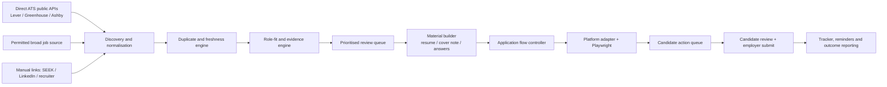

# Applicant Zero product reset

> **Superseded implementation direction.** This document records the earlier
> browser-assistance proposal and source research. Applicant Zero now focuses
> on permitted discovery, ranking, truthful preparation packs and tracking;
> Rishi completes every employer application personally. Its discovery-source
> analysis remains relevant, but browser-flow implementation sections are not
> part of the active roadmap.

## Product decision

Applicant Zero should become a **supervised job-search operating system**, not a collection of one-off browser scripts. Its purpose is to find relevant Sydney roles early, decide whether the evidence supports an application, prepare a truthful role-specific package, pre-fill ordinary fields across supported application systems, and leave only genuine candidate decisions for review.

The system should make many decisions automatically. It should never fabricate a fact, bypass a platform control, create an employer account, solve a CAPTCHA, make a legal declaration, or submit an application without Rishi pressing the employer's final Submit button.

This is not a limitation of AI intelligence. It is the difference between a system that stays useful and a fragile bot that loses access, creates inconsistent applications, or sends an inaccurate declaration.

## What the research supports

### Discovery should use direct source connectors first

The dependable free sources are public career-board interfaces, rather than broad scraping. Lever exposes a public Postings API for published roles, including individual role detail.[^lever] Greenhouse provides public Job Board API reads for published jobs and job details.[^greenhouse] Ashby also provides a public job-posting API.[^ashby]

Applicant Zero should therefore collect from:

1. A maintained target-company list for Sydney employers and consulting firms.
2. Direct Lever, Greenhouse, Ashby and SmartRecruiters public-board connectors.
3. The existing permitted job data source for broader discovery.
4. A manual import route for roles found through SEEK, LinkedIn, recruiter messages and referrals.

SEEK is a discovery and application destination, not a source to automate around. SEEK's public terms explicitly say it uses technical measures to detect and prevent automated access and scraping, while its developer API requires approval.[^seek-terms][^seek-api] The product should link to SEEK roles and assist only after Rishi opens a permitted application route himself.

### APIs do not turn every job board into an automatic application channel

Lever and Greenhouse have application endpoints, but they are intended for the employer or the employer's authorised custom careers site. Lever says the application endpoint uses an API key generated by that employer's Super Admin.[^lever] Greenhouse likewise requires that job board's API key for submissions.[^greenhouse] Those are not candidate APIs available to a job seeker.

This is why paid auto-apply services generally use a candidate-controlled browser session, pre-filled profiles, and manual exception handling. They do not possess a universal legal API key for every employer.

### Use an agent framework only where it adds value

The OpenAI Agents SDK is a good fit for the intelligence layer because it supports structured tools, multiple specialised agents, and human-in-the-loop pauses.[^agents-tools][^agents-hitl] It should be used behind deterministic application rules, not as an unrestricted browser controller.

LangGraph is a strong alternative if durable graph-based orchestration becomes necessary; it is designed for long-running, stateful workflows and human intervention.[^langgraph] It is not needed for the next prototype release. We should start with an explicit Python state machine and use the SDK for structured reasoning. That gives clearer logs, lower complexity and less vendor lock-in.

n8n Community Edition can be self-hosted at no licence cost and is useful later for schedules and notifications.[^n8n] It should not be the core application engine: job matching, answer evidence, resumé generation and browser control belong in Applicant Zero's own code.

### Do not adopt anti-bot or CAPTCHA bypass tooling

Tools described as Cloudflare, bot-detection or CAPTCHA bypassers do not solve the product problem. They increase account and access risk, are brittle when a site changes, and conflict with the platforms' controls. Applicant Zero will not use Scrapling's bypass-oriented features or equivalent evasion tools. A CAPTCHA is a deliberate handoff point: the workflow pauses and tells Rishi what needs attention.

### MCP is useful but not the foundation

Model Context Protocol can expose trusted tools such as a local browser, a database, calendar, Drive or email search to an AI model. It does not grant permission to a job board, make a private API public, or make an unreliable browser flow reliable. Applicant Zero should add MCP connections only after evaluating the publisher, permissions, data handling and exact value. The initial product can use direct Python integrations more safely.

## Final architecture

### 1. Candidate fact library

This is the source of truth. It contains verified contact details, availability, work history, projects, education, links, resumé masters, standard answers and an evidence ledger. Every fact has a status:

| Status | System behaviour |
| --- | --- |
| Verified reusable | May pre-fill matching ordinary fields. |
| Derived but supported | May draft text and label it for review. |
| Unknown or job-specific | Ask one clear question and store the response only after Rishi confirms it. |
| Protected declaration | Never infer, select or submit it. |

Protected declarations include visa/work rights, citizenship, disability, race/ethnicity, gender, date of birth, medical history, criminal history, veteran status, passwords and CAPTCHA. Pronouns can be stored as a verified reusable profile value once Rishi confirms them; the agent should not guess them from a name.

### 2. Discovery and normalisation agent

This agent runs on a schedule. It fetches public ATS feeds, imports permitted results, normalises titles, companies, locations, employment types and descriptions, then hashes each listing to identify exact and near duplicates. It records first seen, last seen, source and whether the listing disappeared.

It should produce one clean record even when the same job appears through an ATS board, a company website and a broader job feed.

### 3. Role-fit and evidence agent

This agent uses rules and structured LLM output together. Rules handle location, target role family, seniority, freshness and unsupported minimum-experience requirements. The LLM extracts required skills, responsibilities, domain knowledge and application questions from the job description. It maps each requirement to exact candidate evidence or labels it unsupported.

The output is not free-form prose. It is a typed decision record with:

- recommended action: strong apply, apply, review or skip;
- selected resumé family;
- matched evidence;
- missing evidence;
- confidence and explanation;
- one concise list of questions only when necessary.

### 4. Material builder agent

For roles worth pursuing, this agent creates:

- a one-page preparation brief;
- a role-specific editable Word resumé copy from the relevant master;
- a PDF only after the Word copy is reviewed;
- a concise cover letter only if the role calls for one;
- proposed answers to job-specific questions, marked as supported or unsupported.

It must treat the evidence ledger as a hard boundary. It may improve wording and select relevant true material; it may not make up metrics, dates, employers, tools, qualifications or employment status.

### 5. Application flow controller

This is the part that makes multi-step forms work. It is a state machine, not an unbounded chat loop.

For every form page it will:

1. Read accessible labels, visible helper text, input types, required status and dropdown options.
2. Classify each field as known-safe, answer-draftable, protected, upload, account, CAPTCHA, unknown or final-submit.
3. Fill only known-safe fields from the fact library.
4. Attach the approved resumé.
5. Advance an ordinary Next/Continue step only when that page is complete and there is no CAPTCHA or protected declaration waiting.
6. Save a structured session trace and screenshot reference for every pause.
7. Resume from the same state after Rishi completes the required handoff.

The controller must never click any control whose wording or page context indicates final submission, even if it looks similar to Continue.

### 6. Platform adapters

The generic controller needs small source-specific adapters, tested separately:

| Platform | Discovery | Preparation / browser assistance | Product status |
| --- | --- | --- | --- |
| Lever | Public postings API | Good first adapter; hosted forms vary by employer | Build first |
| Greenhouse | Public Job Board API | Supported pilot after a test matrix | Build second |
| Ashby | Public job-posting API | Supported pilot after a test matrix | Build third |
| SEEK | No candidate use of unapproved API | Link/manual handoff only | Discovery link only |
| LinkedIn | Manual link/import | Login and application handoff only | Manual-first |
| Workday | Company-specific pages | Manual-first, then adapters only after real tests | Later |

An adapter does not mean that every employer on that ATS will behave identically. Each supported platform earns its status through real, supervised test cases.

### 7. Dashboard product design

The current dashboard proves the data flow; it is not the final interface. The replacement should use a dedicated front end and a stable API:

- **Backend:** FastAPI, Python domain services, SQLAlchemy and SQLite first; PostgreSQL only when a server is needed.
- **Frontend:** React with TypeScript, Vite and a tested accessible component system such as shadcn/ui.
- **Visual direction:** restrained professional workspace; a left navigation rail, a focused daily queue, clear status chips, compact data tables, role detail drawers and an action queue rather than a single long page.
- **No black-box dashboard:** every score and recommendation should open an explanation, evidence and source record.

The visual redesign begins only after the underlying data contracts are stable, so we do not repeatedly rebuild screens around changing concepts.

### 8. Storage, privacy and operating model

The first durable version should remain local on Rishi's laptop:

- encrypted or OS-protected local secrets;
- no passwords in Applicant Zero files;
- private candidate material excluded from Git;
- SQLite database with scheduled backups;
- local browser profile under Rishi's control;
- Windows Task Scheduler for daily discovery and follow-up notices.

Once two or more platform pilots operate reliably, a small private server can run discovery and material preparation. Browser applications should remain on Rishi's own machine because they contain candidate data, employer sessions and handoff actions.

## What will not be used

| Idea | Decision | Reason |
| --- | --- | --- |
| Random public MCP servers | Do not install by default | High permission and data-handling uncertainty. |
| CAPTCHA or Cloudflare bypass | Do not use | Not sustainable or appropriate for a job-search product. |
| Employer API keys | Do not seek or use | They belong to the hiring organisation, not the applicant. |
| A separate LLM agent for every tiny step | Do not start here | More cost and harder debugging without better results. |
| Fully autonomous final submission | Do not build | Each submission is an external declaration made in Rishi's name. |

## Build sequence

### Release A: Rebuild the core contracts

1. Freeze the prototype as a reference branch.
2. Define a versioned candidate fact schema and evidence ledger.
3. Define job, requirement, material, application-session and action-queue schemas.
4. Add migration, backup and audit-log tests.

### Release B: Build the high-volume discovery engine

1. Add first-class Lever, Greenhouse and Ashby feed connectors.
2. Add source health, freshness and duplicate rules.
3. Establish and maintain a curated Sydney target-company list.
4. Create a daily digest that ranks only the small set needing attention.

### Release C: Build the decision and material engine

1. Add structured requirement extraction and evidence matching.
2. Add a resumé master-to-role-copy pipeline with document rendering checks.
3. Add answer drafting with explicit evidence citations and unsupported flags.
4. Add cost limits, prompt/version logging and evaluation fixtures.

### Release D: Build browser application flows properly

1. Replace generic fill logic with the form-classification state machine.
2. Build and test the Lever adapter across at least five different employer forms.
3. Add resume upload, regular text, number, date, dropdown, radio and multi-select handling where evidence is verified.
4. Add pause/resume, screenshots, state trace and an action queue.
5. Add Greenhouse and Ashby only after their separate test suites pass.

### Release E: Replace the dashboard

1. Create the FastAPI API layer.
2. Build the React workspace around daily queue, role detail, material review, application action queue and outcomes.
3. Test it at desktop and mobile widths.
4. Keep the old dashboard available until the new workspace passes real user testing.

### Release F: Operations and evaluation

1. Add daily scheduling, backup verification, source failure notifications and usage budgets.
2. Build a test corpus of real but anonymised role descriptions and form snapshots.
3. Track matching precision, form-field completion rate, handoff reasons, duplicate rate, time saved and interview conversion.
4. Decide only then whether any components should move to a server.

## First implementation package after this reset

The first proper package should be **Release A plus the discovery contracts**. It will replace the current informal profile and form logic with the schemas that every later agent uses. It will not add another visual patch or a random external integration. When that foundation is in place, the next package can add direct public ATS discovery at meaningful scale.

[^lever]: Lever, [Postings API](https://github.com/lever/postings-api).
[^greenhouse]: Greenhouse, [Job Board API](https://docs.greenhouse.io/job-board.html).
[^ashby]: Ashby, [Job Postings API](https://developers.ashbyhq.com/docs/public-job-posting-api).
[^seek-terms]: SEEK, [Website Terms and Conditions](https://au.seek.com/terms), accessed September 2026.
[^seek-api]: SEEK, [Developer API](https://developer.seek.com/), accessed September 2026.
[^agents-tools]: OpenAI, [Agents SDK: Tools](https://openai.github.io/openai-agents-python/tools/).
[^agents-hitl]: OpenAI, [Agents SDK: Human in the loop](https://openai.github.io/openai-agents-python/human_in_the_loop/).
[^langgraph]: LangChain, [LangGraph overview](https://langchain-ai.github.io/langgraph/index.html).
[^n8n]: n8n, [Self-hosting documentation](https://github.com/n8n-io/n8n-docs/blob/main/docs/deploy/host-n8n/README.md).
